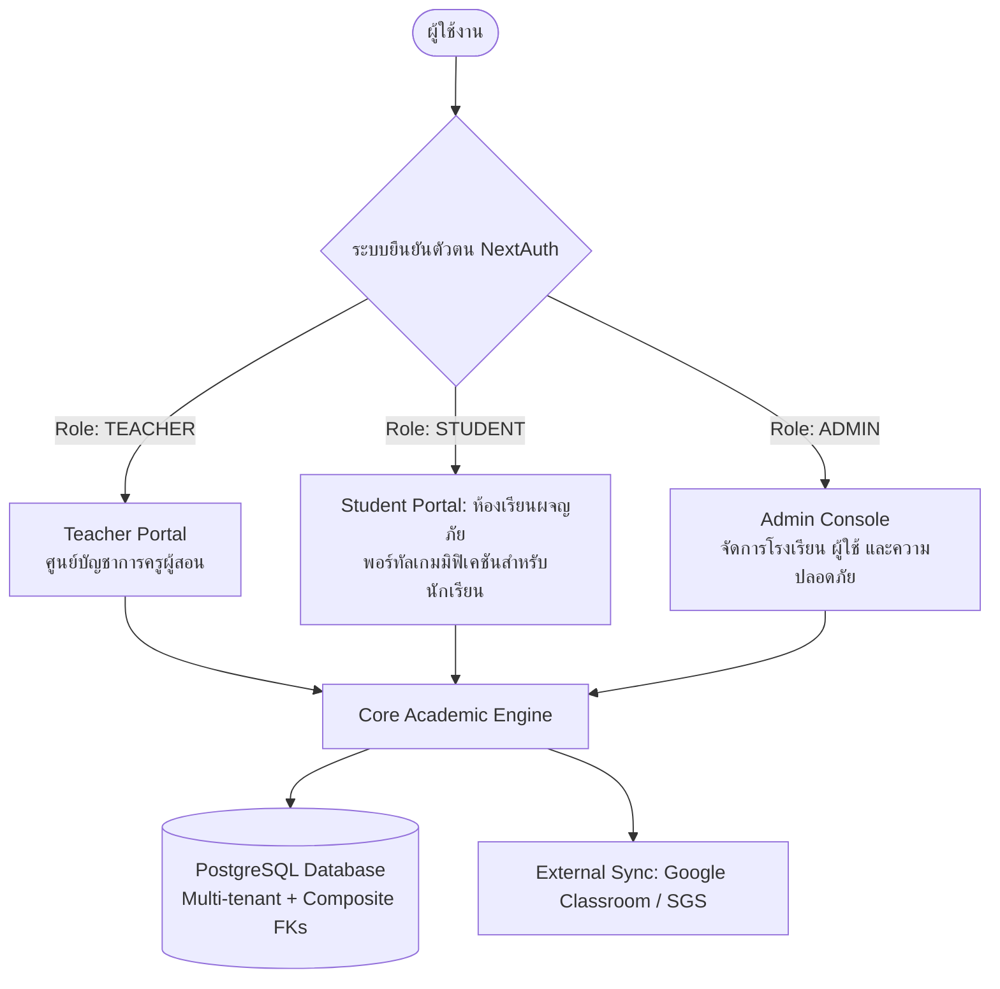
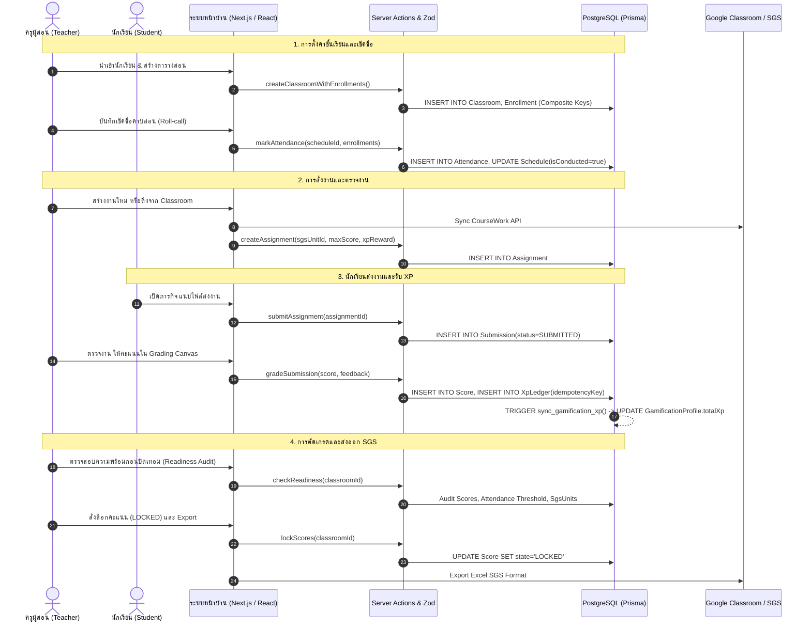

# 🏛️ เอกสารวิเคราะห์ระบบเชิงลึกและแผนพัฒนาฉบับสมบูรณ์ (Comprehensive System Analysis & Action Plan)
> **ระบบจัดการชั้นเรียน (Classroom Management & Gamified Learning Platform)**  
> ครอบคลุม: การวิเคราะห์ฟังก์ชันทุกด้าน, ผังหน้าจอและปุ่มทุกปุ่ม (Page & Button Inventory), Data Flow, สถาปัตยกรรมความปลอดภัย และแผนปฏิบัติการพัฒนาสู่การใช้งานจริง (Production Roadmap)

---

## สารบัญ (Table of Contents)
1. [ภาพรวมสถาปัตยกรรมและกลุ่มผู้ใช้งาน (System Overview & User Personas)](#1-ภาพรวมสถาปัตยกรรมและกลุ่มผู้ใช้งาน)
2. [วิเคราะห์เจาะลึกทุกหน้าและทุกปุ่ม (Complete Page & Button Inventory)](#2-วิเคราะห์เจาะลึกทุกหน้าและทุกปุ่ม)
   - [2.1 ฝั่งครูผู้สอน (Teacher Portal)](#21-ฝั่งครูผู้สอน-teacher-portal)
   - [2.2 ฝั่งนักเรียน: ห้องเรียนผจญภัย (Gamified Student Portal)](#22-ฝั่งนักเรียน-ห้องเรียนผจญภัย-gamified-student-portal)
3. [ผังการไหลของข้อมูลครบวงจร (End-to-End Data Flow Architecture)](#3-ผังการไหลของข้อมูลครบวงจร)
4. [โครงสร้าง API และ Server Action Contracts](#4-โครงสร้าง-api-และ-server-action-contracts)
5. [กลไกความมั่นคงปลอดภัยและความถูกต้องของข้อมูล (Invariants & Security)](#5-กลไกความมั่นคงปลอดภัยและความถูกต้องของข้อมูล)
6. [แผนปฏิบัติการพัฒนาทีละขั้นตอนสู่การใช้งานจริง (Sprint Execution Roadmap)](#6-แผนปฏิบัติการพัฒนาทีละขั้นตอนสู่การใช้งานจริง)

---

## 1. ภาพรวมสถาปัตยกรรมและกลุ่มผู้ใช้งาน

ระบบถูกออกแบบภายใต้โครงสร้าง **Modular Monolith** บน Next.js App Router ผสาน PostgreSQL และ Prisma ORM โดยแบ่งกลุ่มผู้ใช้งานหลักออกเป็น 3 บทบาท:



### กลุ่มผู้ใช้งาน (User Personas):
1. **ครูผู้สอน (Teacher)**:
   - ต้องการความรวดเร็วในการเช็คชื่อ, การกรอกคะแนนแบบตารางความเร็วสูง (Inline Grid), แจ้งเตือนเด็กเสี่ยงตกหล่น (Early Warning), และออกรายงาน SAR/วPA โดยไม่ต้องพิมพ์ซ้ำซ้อน
2. **นักเรียน (Student)**:
   - ต้องการทราบภารกิจการบ้านที่ชัดเจน, สถานะการส่งงาน, คะแนนและ Feedback จากครู, และแรงจูงใจในการเรียนรู้ผ่านสัตว์เลี้ยงคู่หู (Companion Pet) และแต้มประสบการณ์ (XP)
3. **ผู้บริหาร / ฝ่ายวิชาการ (Academic Admin)**:
   - ตรวจสอบความพร้อมก่อนปิดเทอม (Readiness Audit), จัดการโครงสร้าง SGS 100 คะแนน, และส่งออกไฟล์คะแนนตามระเบียบ สพฐ. 100%

---

## 2. วิเคราะห์เจาะลึกทุกหน้าและทุกปุ่ม (Complete Page & Button Inventory)

---

### 2.1 ฝั่งครูผู้สอน (Teacher Portal)

#### หน้าที่ 1: หน้าหลัก (Teacher Global Dashboard)
* **Hero Profile Banner**:
  - `รูปโปรไฟล์ & ข้อมูลครู`: แสดงชื่อ-สกุล, โรงเรียนต้นสังกัด, และคำทักทายตามช่วงเวลา
  - ป้าย `✓ ไม่มีงานรอตรวจ`: คำนวณแบบ Real-time จากจำนวนงานที่ส่งเข้ามาแต่ยังไม่มีคะแนน
  - `ตั้งค่าวันเปิด-ปิด`: Modal กำหนดวันเริ่มต้น-สิ้นสุดภาคเรียน เพื่อนำไปคำนวณหลอด % ความคืบหน้าภาคเรียน (เช่น 15 พ.ค. – 2 ต.ค. 2569 = 93%)
- **การ์ดคาบสอนวันนี้**:
  - แถบสลับ `วันนี้ | สัปดาห์ | เดือน`: สลับมุมมองตารางสอน
  - ป้ายวิชา: เช่น `แนะแนว`, `ชุมนุมดนตรีไทย-พื้นเมือง`
  - ปุ่ม `เช็คชื่อ`: เปิด Modal เช็คชื่อเข้าเรียนของคาบนั้นทันที (บันทึกสถานะ มา, ขาด, ลา, มาสาย และตั้งค่า `isConducted = true`)
- **การ์ดงานที่ต้องทำ (Task Counters)**:
  - บัตร `9 ห้อง ยังมีคาบไม่เช็คชื่อ (รวม 65 คาบ)`: คลิกเพื่อเปิดตารางคาบสอนที่ค้างเช็คชื่อ
  - บัตร `8 ห้อง คะแนนยังกรอกไม่ครบ (รวม 375 ช่อง)`: คลิกเพื่อเจาะไปยังหน้าตารางคะแนนที่ยังว่าง
  - บัตร `9 ห้อง คุณลักษณะฯ / อ่านคิดฯ (รวม 276 คน)`: คลิกเพื่อไปยังหน้าประเมินคุณลักษณะ
  - บัตร `✓ มีงานยังไม่ผูกหน่วย`: ตรวจสอบความถูกต้องของการแมปปิ้งหน่วยการเรียนรู้ SGS
  - บัตร `9 ห้อง ยังไม่พร้อมปิดเทอม`: ลิงก์ตรงสู่หน้าความพร้อมก่อนปิดเทอม
  - ลิงก์ `ดูรายละเอียดรายห้อง →`: ดูแจกแจงภาระงานแยกตามห้องเรียน
- **การ์ดภาพรวมตอนนี้ (KPI Grid)**:
  - `525 นักเรียนที่ดูแล (12 ชั้นเรียน)`
  - `82% ทำได้เฉลี่ย (ของคะแนนที่กรอกแล้ว)`
  - `95% เข้าเรียนเฉลี่ย (ทั้งภาคเรียน)`
  - `7 เกินเกณฑ์ มส (ต้องซ่อมเวลาเรียน)`: คลิกเพื่อดูรายชื่อนักเรียนที่เวลาเรียนต่ำกว่า 80% ทันที
  - `0 ช่องคะแนนว่าง (รวมทุกชั้นเรียน)`
  - ลิงก์ `ความพร้อม →`: ลิงก์สู่หน้ารายงานสรุปความพร้อม
- **การ์ดสิ่งที่ต้องทำ (To-Do List)**:
  - ปุ่ม `+ เพิ่ม`: Modal สร้าง To-Do ส่วนตัวของครู (แจ้งเตือนงานสอน, เตือนนัดหมายผู้ปกครอง)

---

#### หน้าที่ 2: ชั้นเรียนของฉัน (Classroom Detail & Operations)
*ประกอบด้วย 7 แท็บการทำงานย่อย*:

##### แท็บ 2.1: ภาพรวม (Overview)
- **การ์ด "ต้องดูแล 4 คน" (Early Warning)**:
  - รายชื่อนักเรียนพร้อมแท็ก: `คะแนนต่ำกว่าครึ่ง`, `ค้าง 3 ชิ้น`
  - สถิติ `ขาด/ลา` และ `คะแนนรวม`
  - ปุ่ม `ดูคะแนนเต็มตาราง →`: ลิงก์สู่ตารางคะแนนรวมทั้งห้อง
  - แถวนักเรียน: สามารถคลิกเพื่อเปิดหน้าประวัติเดี่ยวและ Radar Chart 5 มิติ
- **การ์ด "ยังกรอกคะแนนไม่ครบ"**: บัตรตัวเลขแสดงงานที่ค้างตรวจ (23, 20, 2 คน)
- **การ์ด "ชิ้นงานที่ห้องนี้ทำได้ต่ำที่สุด"**: แสดง Progress Bar เรียงจากน้อยไปมาก (81% ถึง 100%) เพื่อให้ครูเห็นจุดที่ต้องสอนซ่อมเสริม
- **การ์ด "การกระจายเกรด"**: แถบแนวนอนแจกแจงเกรดจำลอง 8 ระดับ (4, 3.5, 3, 2.5, 2, 1.5, 1, 0)
- **ปุ่มหัวหน้าจอ**:
  - `สัดส่วนคะแนน`: Modal จัดการน้ำหนักคะแนนเต็ม 100 ของวิชานี้
  - `ย้ายรายวิชา`: ย้ายห้องเรียนนี้ไปยังรายวิชาอื่น
  - `ลบชั้นเรียน`: ย้ายชั้นเรียนเข้าสู่ถังขยะ (Soft Delete)

##### แท็บ 2.2: เช็คชื่อ (Attendance Roster)
- **หัวตาราง**:
  - แสดงจำนวนคาบทั้งหมด (เช่น `คาบสอนทั้งหมด 20 คาบ`)
  - ปุ่ม `📅 สร้างคาบทั้งภาคเรียน`: คำนวณวันในสัปดาห์ตลอด 20 สัปดาห์สร้าง Record คาบเรียนลงฐานข้อมูลอัตโนมัติ
  - ปุ่ม `+ เพิ่มคาบสอน`: เพิ่มคาบสอนชดเชย หรือคาบกิจกรรมพิเศษ
  - ช่อง `Q กรองรายการ...`: ค้นหาตามวันที่หรือเรื่องที่สอน
- **ตารางประวัติคาบเรียน**:
  - คอลัมน์: Checkbox, วันที่, คาบ, เรื่องที่สอน, สถานะ (สอนปกติ/งดสอน), การเช็คชื่อ (มา 23, ลา 1, ยังไม่เช็คชื่อ)
  - ปุ่ม `เช็คชื่อ` (สีเขียว): เปิด Modal เช็คชื่อนักเรียนในคาบนั้น
  - ปุ่ม `แก้เช็คชื่อ`: ปรับปรุงข้อมูลการมาเรียนย้อนหลัง
  - ปุ่ม `แก้` / `ลบ`: แก้ไขหัวข้อที่สอน หรือลบคาบเรียน

##### แท็บ 2.3: งาน / คะแนนสอบ (Assignments & Exams)
- **ตัวเลือกสลับ**: `การบ้าน / ชิ้นงาน` vs `คะแนนสอบ`
- **ปุ่ม Action Bar**:
  - `ใช้ซ้ำงานเดิม`: คัดลอกชิ้นงานจากห้องเรียนอื่นในวิชาเดียวกันโดยไม่ต้องพิมพ์ใหม่
  - `↓ นำเข้าคะแนนจาก Classroom`: ซิงค์คะแนนจาก Google Classroom API
  - `+ มอบหมายงานใหม่`: สร้างการบ้านใหม่ กำหนดคะแนนเต็ม, หน่วย SGS, กำหนดส่ง และแต้ม XP
- **ตารางรายการงาน**:
  - แท็ก `🔗 ใช้ร่วม X ห้อง`
  - หมวดคะแนน: `เก็บก่อนกลางภาค`, `เก็บหลังกลางภาค`, `สอบกลางภาค`, `สอบปลายภาค`
  - หน่วย SGS: ระบุคอลัมน์เทียบเคียง SGS เช่น `ช่อง 2 • หน่วยที่ 1`
  - อัตราการส่งงาน: เช่น `23/23` (สีเขียว), `0/23` (สีเทา)
  - ปุ่ม `บันทึกส่ง/คะแนน`: เปิดตาราง Fast Inline Grid บันทึกคะแนนนักเรียน
  - ปุ่ม `ปิดรับงาน`: ตัดงานที่นักเรียนไม่ส่งให้เป็น 0 อัตโนมัติในคลิกเดียว
  - ปุ่ม `แก้` / `ลบ`: แก้ไขรายละเอียดงานหรือลบงาน

##### แท็บ 2.4: สรุปคะแนน (Score Summary Grid)
- ตาราง TanStack Table รวบรวมคะแนนทุกช่อง (หน่วยที่ 1-5 + กลางภาค + ปลายภาค) รวม 100 คะแนน
- แสดงเกรดคำนวณสดแบบ Real-time
- ปุ่ม `Export Excel สำหรับส่งวิชาการ`

##### แท็บ 2.5: พฤติกรรม (Behavior & Traits)
- แบบบันทึกคุณลักษณะอันพึงประสงค์ 8 ประการ (รักชาติ, ซื่อสัตย์, มีวินัย ฯลฯ)
- แบบประเมินการอ่าน คิดวิเคราะห์ และเขียน (ดีเยี่ยม, ดี, ผ่าน, ไม่ผ่าน)
- บันทึกการตักเตือน / ความดี พร้อมแต้มพฤติกรรม

##### แท็บ 2.6: บันทึกหลังสอน (Lesson Reflections)
- บันทึกผลการจัดการเรียนรู้, ปัญหาอุปสรรค, และแนวทางแก้ไขรายคาบ เพื่อรวบรวมเป็นเล่มรายงานวิชาการ

##### แท็บ 2.7: ห้องเรียนผจญภัย
- ลิงก์สลับมุมมองสู่พอร์ทัลฝั่งนักเรียน เพื่อให้ครูเห็นภาพเดียวกับที่นักเรียนเห็น

---

#### หน้าที่ 3: จัดการการสอบ (Exam Management)
- **ปุ่ม `+ สร้างชุดข้อสอบใหม่`**: กำหนดชื่อการสอบ, วิชา, หน่วย SGS, คะแนนเต็ม, และวันที่สอบ
- **ตัวกรองสถานะ**: `ทั้งหมด`, `กำลังกรอกคะแนน`, `ล็อกคะแนนแล้ว (LOCKED)`, `เร็วๆ นี้`
- **การ์ดชุดข้อสอบ**: แสดงคะแนนเฉลี่ย, สูงสุด, ต่ำสุด
- **ปุ่ม `เปิดตารางกรอกคะแนน`**: ตาราง Fast Inline Editing บันทึกคะแนนสอบ
- **ปุ่ม `วิเคราะห์ข้อสอบ (Item Analysis)`**: คำนวณค่าความยาก ($p$), อำนาจจำแนก ($r$), Mean, SD
- **ปุ่ม `ล็อกคะแนน (LOCKED)`**: ป้องกันการแก้ไขหลังประกาศผล

---

#### หน้าที่ 4: จัดการงาน / การบ้าน (Assignment Management Canvas)
- **ภาพรวมงานทุกห้อง**: ตรวจสอบงานที่ค้างตรวจทั่วทั้งโรงเรียน
- **หน้าห้องตรวจผลงาน (Grading Canvas)**:
  - ฝั่งซ้าย: พรีวิวไฟล์ที่นักเรียนส่ง (PDF, รูปภาพ, วิดีโอ, ลิงก์ Google Drive)
  - ฝั่งขวา: กรอกคะแนน, เช็คบ็อกซ์ยกเว้นคะแนน (`isExempt`), พิมพ์ข้อเสนอแนะ Feedback
  - ปุ่ม `บันทึกผลการตรวจและมอบ XP`: ลงบัญชี `Score` และเพิ่มแต้มลง `XpLedger` อัตโนมัติ

---

#### หน้าที่ 5: ความพร้อมก่อนปิดเทอม (End-of-term Readiness Checklist)
- **แถบสถานะ**: แสดงจำนวนห้องที่พร้อมส่งผลการเรียน เช่น `พร้อมส่ง 0 จาก 9 ชั้นเรียน`
- **การ์ดแจกแจงรายห้อง**:
  - ป้าย `2/5 ข้อ`, `27 คน`
  - ป้ายเตือน: `คะแนนยังว่าง 17 ช่อง`, `คุณลักษณะฯ 0/27`, `เวลาเรียนไม่พอ 3 คน`
- **กล่องงานที่คะแนนยังว่าง (ขอบส้ม)**:
  - แสดงรายการงานพร้อมป้าย `ว่าง X ช่อง`
  - ปุ่ม `กรอกคะแนน →` และปุ่ม `ปิดรับงาน`
  - ปุ่ม `ดูภาพรวมคะแนนของห้องนี้ →`
- **กล่องประเมินคุณลักษณะฯ (ขอบส้ม)**:
  - รายชื่อนักเรียนพร้อมช่องกรอกระดับผลการประเมิน
- **ปุ่ม `ล็อกคะแนนและส่งวิชาการ`**: สั่งล็อกคะแนนทั้งห้อง (`ScoreState.LOCKED`) และส่งออกข้อมูล

---

#### หน้าที่ 6: เทียบผลข้ามห้อง & รายงาน SAR / วPA (Cross-Class Comparison)
- **Hero Metric Banner**: ตัวเลขร้อยละภาพรวม (เช่น `84.8% ของนักเรียนทั้งหมดได้เกรด 3 ขึ้นไป`), ตัวนับคนที่ถึงเกณฑ์ (234), คนทั้งหมด (276), 4 รายวิชา
- **ตัวกรองเกณฑ์**: เช่น `[เกรด 3 ขึ้นไป ▼]`, `[เกรด 2 ขึ้นไป ▼]`, `[เกรด 1 ขึ้นไป ▼]`
- **ตารางสรุปผลการสอนรายวิชา**: รหัสวิชา, รายวิชา, ระดับชั้น, ห้องเรียน, จำนวนนักเรียน, คะแนนเฉลี่ย, สัดส่วนผ่านเกณฑ์ พร้อมแถวรวมทุกวิชา
- **ตารางแจกแจงเกรด 8 ระดับ (Grade Distribution Matrix)**: ตารางแสดงจำนวนคนและร้อยละของเกรด 4, 3.5, 3, 2.5, 2, 1.5, 1, 0 แยกรายห้องและรายวิชา
- **ปุ่ม `พิมพ์รายงาน SAR/PA (PDF/Excel)`**

---

#### หน้าที่ 7: ข้อมูลหลัก (Master Data & Settings)
- **รายวิชา / หลักสูตร**: จัดการรหัสวิชา, ชื่อวิชา, หน่วยกิต, และโครงสร้างหน่วยการเรียนรู้ SGS ให้ครบ 100 คะแนน
- **แผนการสอน**: วางแผนการสอนสัปดาห์ที่ 1 ถึง 20 พร้อมบันทึกหลังสอน
- **ห้องเรียน / นักเรียน**:
  - รายชื่อห้องเรียน (ม.1 ถึง ม.6)
  - บัญชีรายชื่อนักเรียนในห้อง (Roster Table)
  - ปุ่ม `นำเข้ารายชื่อจาก Excel/SGS`: อัปโหลดไฟล์รายชื่อนักเรียนและแปลงเข้าสู่ระบบทันที
  - คลิกนักเรียนเพื่อเปิดดู **Radar Chart 5 มิติ** และบันทึกเชิงลึกเฉพาะบุคคล
- **ตารางสอน / คาบเรียน**: ตารางสอนประจำสัปดาห์แบบ Matrix วันจันทร์-ศุกร์ คาบ 1-8
- **ปีการศึกษา**: สลับภาคเรียนที่ใช้งาน (Active Term) และจัดเก็บประวัติ (Archive)

---

#### หน้าที่ 8: ระบบ (System Administration)
- **ตั้งค่า / สำรองข้อมูล**:
  - ข้อมูลโรงเรียน
  - **SGS Data Export Tool**: ส่งออกไฟล์คะแนนตามฟอร์แมตระบบ SGS ของ สพฐ. 100%
  - สำรองข้อมูลฐานข้อมูล (Database Snapshot)
  - เชื่อมต่อ Google Classroom OAuth
- **ถังขยะ (Trash & Soft Delete Lifecycle)**:
  - รายการชั้นเรียน, งาน, ข้อมูลที่ถูกลบชั่วคราว พร้อมนับถอยหลัง 30 วัน
  - ปุ่ม `กู้คืน (Restore)` และปุ่ม `ลบถาวร (Hard Delete)`
- **บัญชีและรหัสผ่าน**: จัดการรายชื่อครูและนักเรียน, กำหนดบทบาท, พิมพ์สลิปรหัสผ่านเริ่มต้นให้นักเรียน

---

### 2.2 ฝั่งนักเรียน: ห้องเรียนผจญภัย (Gamified Student Portal)

#### หน้าที่ 1: พื้นที่ของฉัน (My Space / Adventure Dashboard)
- **แถบด้านบน**: เหรียญรางวัล `⭐ 0 XP`, ตัวบ่งชี้ภาคเรียน, ปุ่ม `ออกจากระบบ`
- **Banner ต้อนรับ**: กราฟิก Pixel Art ของสัตว์เลี้ยง **"โมจิ จิ้งจอกใบไม้"**, ข้อความสร้างแรงบันดาลใจ, ปุ่ม `ไปทำภารกิจ →`
- **ตัวนับสถิติ 3 ช่อง**: `ภารกิจที่รอทำ`, `งานที่ส่งแล้ว`, `ภารกิจที่ได้ XP`
- **การ์ดคู่หูของฉัน (Companion Card)**: แสดงตัวละครโมจิ, เลเวล (`Lv. 1`), แถบ XP (`0 / 100 XP`), ปุ่ม `เปลี่ยนคู่หู`
- **การ์ดก้าวเล็ก ๆ ที่สำเร็จ (Milestone Badges)**: แสดงเหรียญตรา `ก้าวแรก`, `นักลงมือ`, `ไม่หยุดพัฒนา`
- **กระดานภารกิจ (Quest Board)**:
  - ตัวกรองวิชา, แท็บ `รอดำเนินการ`, `ส่งแล้ว`, `ทั้งหมด`
  - การ์ดงานระบุแต้มรีวอร์ด `+30 XP เมื่อครูตรวจผ่าน`, ปุ่ม `เปิดภารกิจ →`

#### หน้าที่ 2: ภารกิจ / การบ้าน (Missions & Submissions)
- หน้ารายละเอียดงาน: คำชี้แจงจากครู, ไฟล์แนบ, กำหนดส่ง
- กล่องส่งงาน: อัปโหลดไฟล์ PDF/รูปภาพ/วิดีโอ หรือแนบลิงก์ Google Drive
- สถานะการตรวจและ Feedback จากครู พร้อมแอนิเมชันรับแต้ม `+XP` เข้าสัตว์เลี้ยง

#### หน้าที่ 3: สนามท้าทาย (Challenge Arena & Quizzes)
- แบบทดสอบฝึกฝนทบทวนความรู้ประจำสัปดาห์ (Gamified Mini-quiz) เพื่อรับ XP โบนัส
- บอร์ดความท้าทายร่วมกันในห้องเรียน (Class Cooperative Challenges)

#### หน้าที่ 4: สถิติและคะแนน (My Gradebook & Attendance)
- สมุดคะแนนส่วนตัวของนักเรียน (แสดงเฉพาะตนเอง): แจกแจงคะแนนแต่ละหน่วย SGS
- กราฟเวลาเรียน: เปอร์เซ็นต์การเข้าเรียน (แจ้งเตือนความเสี่ยง มส. หากต่ำกว่า 80%)
- Radar Chart 5 มิติของตนเอง เพื่อดูจุดแข็งและจุดที่ต้องพัฒนา

#### หน้าที่ 5: ตู้รางวัล (Trophy Room & Pet Evolution)
- ตู้โชว์เหรียญรางวัลความสำเร็จทั้งหมดที่ปลดล็อก
- ระบบพัฒนาสัตว์เลี้ยง: เพิ่มเลเวลโมจิ, ปลดล็อกสัตว์เลี้ยงตัวใหม่ (นกฮูกเวทมนตร์, กบนินจา)

---

## 3. ผังการไหลของข้อมูลครบวงจร (End-to-End Data Flow)



---

## 4. โครงสร้าง API และ Server Action Contracts

ทุก Mutation ถูกควบคุมด้วย **Zod Validation** และ **Resource-Level Authorization Wrapper**:

### 1. Attendance Action: `markPeriodAttendance`
```typescript
export const markAttendanceSchema = z.object({
  schoolId: z.string().cuid(),
  classroomId: z.string().cuid(),
  scheduleId: z.string().cuid(),
  records: z.array(z.object({
    enrollmentId: z.string().cuid(),
    status: z.enum(['PRESENT', 'ABSENT', 'LATE', 'LEAVE']),
  })),
});
```

### 2. Grading Action: `saveScoreAndAwardXp`
```typescript
export const gradeScoreSchema = z.object({
  schoolId: z.string().cuid(),
  classroomId: z.string().cuid(),
  assignmentId: z.string().cuid(),
  enrollmentId: z.string().cuid(),
  value: z.number().min(0),
  isExempt: z.boolean().default(false),
  feedback: z.string().optional(),
  xpAmount: z.number().int().min(0),
});
```

### 3. Score Locking Action: `lockClassroomScores`
```typescript
export const lockScoresSchema = z.object({
  schoolId: z.string().cuid(),
  classroomId: z.string().cuid(),
  confirmPasscode: z.string(),
});
```

---

## 5. กลไกความมั่นคงปลอดภัยและความถูกต้องของข้อมูล (Invariants & Security)

1. **Composite Foreign Keys**:
   - ทุกตาราง `Score`, `Attendance`, `Assignment` ต้องผูกกับ `classroomId` เสมอ เพื่อป้องกันข้อผิดพลาดการบันทึกคะแนนข้ามห้อง (`@@unique([id, classroomId])`)
2. **Database Invariants via Triggers**:
   - `enforce_max_score`: ตรวจสอบระดับ DB ว่าคะแนนต้องไม่เกิน `Assignment.maxScore`
   - `enforce_locked_score`: ป้องกันการแก้ไขคะแนนเมื่อ `Score.state === 'LOCKED'` โดยเด็ดขาด
   - `sync_gamification_xp`: คำนวณ Reconcile ยอด `totalXp` อัตโนมัติจากตาราง `XpLedger` ป้องกันการแฮกแต้มจากฝั่ง Client
3. **Attendance Denominator Guard**:
   - นับฐานคาบเรียนเฉพาะ `Schedule.type === 'NORMAL' AND Schedule.isConducted === true AND Schedule.schoolDate <= CURRENT_DATE` เพื่อไม่ให้นักเรียนโดนแจ้งเตือน มส. ผิดพลาดในช่วงต้นเทอม

---

## 6. แผนปฏิบัติการพัฒนาทีละขั้นตอนสู่การใช้งานจริง (Sprint Execution Roadmap)

```
[Sprint 0] วางรากฐานและ DB Invariants (สัปดาห์ 1)
   ├── ตั้งค่า Next.js App Router, Tailwind, shadcn/ui
   ├── ตั้งค่า PostgreSQL (Neon) และรัน Prisma Custom Migrations (Triggers/Check)
   └── ระบบยืนยันตัวตน NextAuth + RBAC Middleware

[Sprint 1] ข้อมูลหลัก ทะเบียนนักเรียน และตารางสอน (สัปดาห์ 2-3)
   ├── ระบบนำเข้า Excel / SGS Roster เข้าตาราง Enrollment
   ├── ตารางสอนแบบ Matrix และระบบเช็คชื่อรายคาบ (isConducted Guard)
   └── ระบบโครงสร้างรายวิชาและหน่วย SGS 100 คะแนน

[Sprint 2] ระบบจัดการงาน การสอบ และตารางคะแนน (สัปดาห์ 4-5)
   ├── UI ตารางกรอกคะแนนความเร็วสูง (TanStack Table Inline Grid)
   ├── Grading Canvas ตรวจผลงานพร้อมแนบ Feedback
   └── ระบบวิเคราะห์ข้อสอบ (Item Analysis: p, r)

[Sprint 3] พอร์ทัลห้องเรียนผจญภัยและเกมมิฟิเคชัน (สัปดาห์ 6)
   ├── สัตว์เลี้ยงโมจิ Pixel Art และหลอด XP Progress Bar
   ├── กระดานภารกิจของนักเรียน และระบบส่งงานแนบไฟล์/ลิงก์
   └── ตู้รางวัล และบันทึก XP ลงตาราง XpLedger แบบ Idempotent

[Sprint 4] การตรวจความพร้อม ปิดเทอม และส่งออก SGS (สัปดาห์ 7)
   ├── ระบบ Audit Checklist ความพร้อมก่อนปิดเทอม
   ├── ตัวคำนวณตัดเกรด 8 ระดับอัตโนมัติ และระบบสั่งล็อกคะแนน (LOCKED)
   ├── ระบบส่งออกไฟล์ตามฟอร์แมต SGS ของ สพฐ. 100%
   └── รายงานเปรียบเทียบผลข้ามห้อง SAR / วPA

[Sprint 5] UAT, Security Hardening & Go-Live (สัปดาห์ 8)
   ├── ทดสอบโหลดพร้อมกัน (Concurrent Load Testing)
   ├── เชื่อมโยง Google Classroom Sync ด้วย Upstash QStash
   └── ฝึกอบรมครูผู้สอนและเริ่มเปิดใช้งานจริงในสถานศึกษา
```
